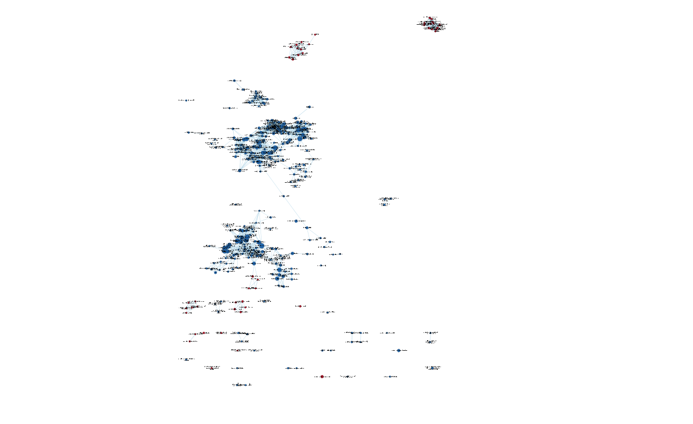
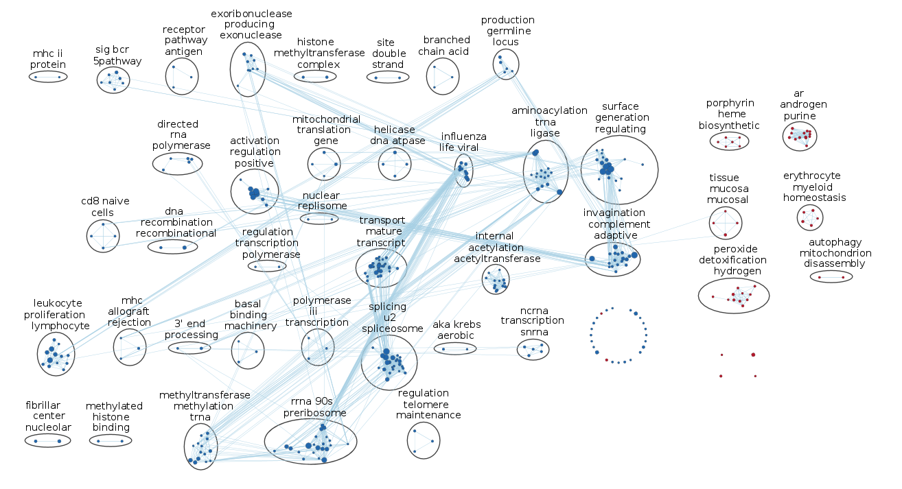
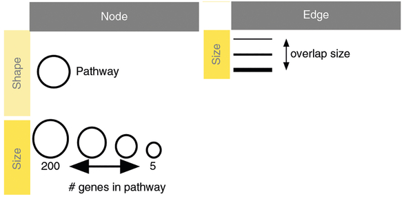
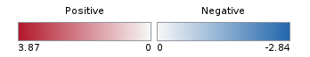
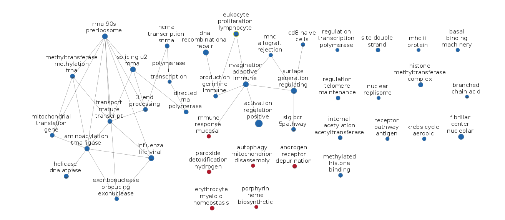
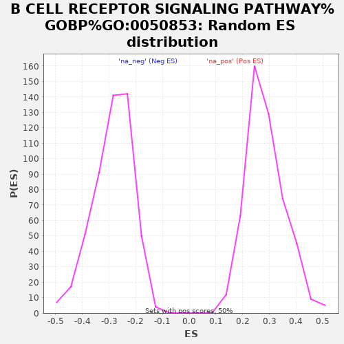
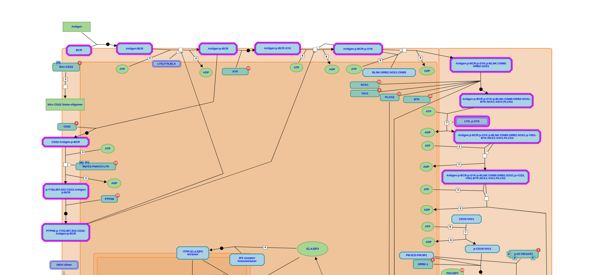
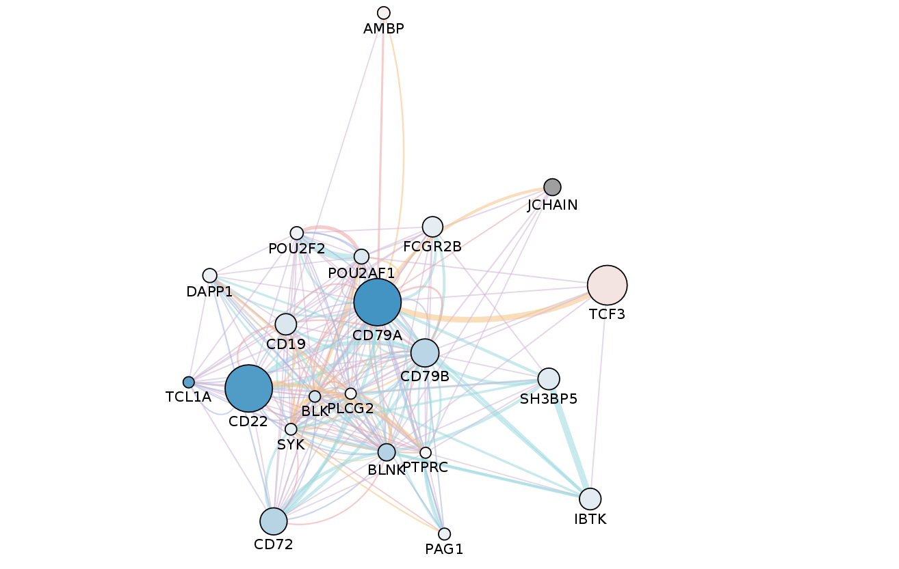
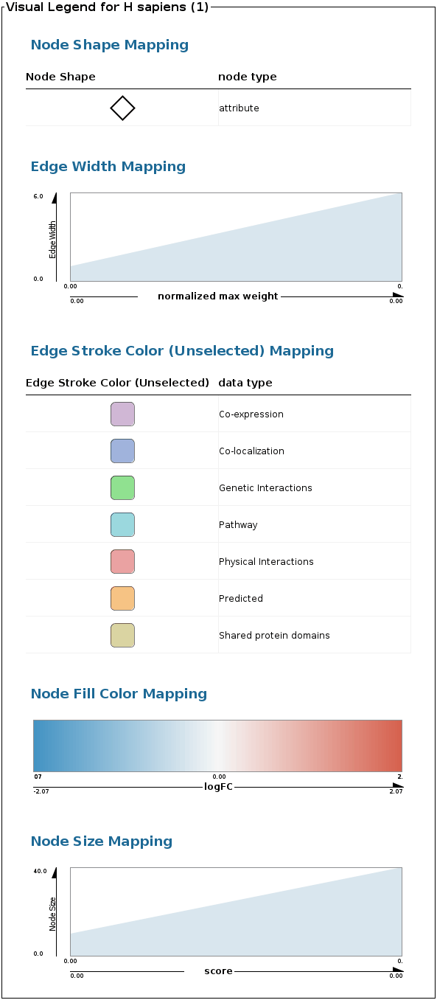

## Introduction

In the previous assignment we looked at data from GEO Accession GSE31729, which is associated with the paper "Lack of effect in desensitization with intravenous immunoglobulin and rituximab in highly-sensitized patients" by Akalin et al. 
This dataset contains gene expression profiles of blood samples gathered with Affymetrix Human Gene 1.0 ST Array of transplant patients, and it is trying to determine the effect of a combined treatment of intravenous immunoglobulin & rituximab on highly sensitized patients (the desired effect would be a desensitization, which would make these patients less likely to reject transplants).

In the previous analysis we removed an outlier sample (number 39) and normalized the data. We discovered a total of 8004 unmapped probes, which were removed, giving us a total of 25293 probes. Then we found differentially expressed genes, compared up- and down-regulated genes, and performed a thresholded gene set enrichment analysis on them separately using gProfiler.

```{r include=FALSE}
# Load in data from previous assignment
rankedList <- readRDS("Assignment_2_Data.Rds")

# Write a .rnk file to use in GSEA pre-ranked analysis
write.table(rankedList, file="rankedList.rnk", sep="\t", row.names = F, col.names = F, quote = F)
```

## Non-thresholded Gene set Enrichment Analysis

### What method did you use? What genesets did you use? Make sure to specify versions and cite your methods.
GSEA on a pre-ranked list ("rankedList.rnk") was performed, using the output of topTable from the previous assignment. The number of permutations was set to 1000. The gene set used was Human_GO_AllPathways_with_GO_iea_February_01_2020_symbol.gmt from the Bader Lab genesets, since this has far more annotations than the GSEA defaults. Since the ranked list was already using HGNC symbols, the option "No collapse" was chosen. Maximum gene set size was set to 500, and minimum was set to 15. 

### Summarize your enrichment results.

```{r}
neg.table <- read.table(file="data/GSE31729.GseaPreranked.1585259885104/gsea_report_for_na_neg_1585259885104.xls", stringsAsFactors = F, sep="\t", header=T, fill=T)
pos.table <- read.table(file="data/GSE31729.GseaPreranked.1585259885104/gsea_report_for_na_pos_1585259885104.xls", stringsAsFactors = F, sep="\t", header=T, fill=T)
```

For the upregulated genes (na_pos): 

3796 / 8280 gene sets are upregulated in phenotype na_pos

321 gene sets are significant at FDR < 25%

272 gene sets are significantly enriched at nominal pvalue < 1%

The most significant gene sets were: 

`r knitr::kable(pos.table[c(1,4,6,10)][1:10, ])`

For the downregulated genes (na_neg):

4484 / 8280 gene sets are upregulated in phenotype na_neg

1437 gene sets are significantly enriched at FDR < 25%

695 gene sets are significantly enriched at nominal pvalue < 1%

The most significant gene sets were:


`r knitr::kable(neg.table[c(1,4,6,10)][1:10, ])`

### How do these results compare to the results from the thresholded analysis in Assignment #2. Compare qualitatively. 
Several of the results for the down-regulated genes were similar to those obtained in Assignment 2, but not for upregulated. The upregulated themes in this analysis seem more relevant to the study however, as in the previous analysis the majority of upregulation was related to purine/nucleotide catabolism. Some of these are still present (the DEPURINATION Reactome pathway, for example, at position 37 in the positive phenotype) but they are less common.

### Is this a straight forward comparison? Why or why not?

No. The main reason is that GSEA is non-thresholded and gProfiler is thresholded, so there is a difference in the information that they are using for analysis. Additionally, the geneset files (.gmt) are different, and gProfiler does not seem to use geneset size limits for its analysis.

### Create an enrichment map - how many nodes and how many edges in the resulting map? What thresholds were used to create this map? Make sure to record all thresholds. Include a screenshot of your network prior to manual layout.

FDR Q-value: 0.02

Edge similarity cutoff: 0.375

340 nodes.

1923 edges.




### Annotate your network - what parameters did you use to annotate the network. If you are using the default parameters make sure to list them as well.

The network was annotated using the default parameters in AutoAnnotate, using the GS_DESCR column, the MCL cluster algorithm, the similarity coefficient for determining the edge weights, and the WordCloud: Adjacent Words algorithm. 

### Make a publication ready figure - include this figure with proper legends in your notebook.

<center>







</center>


### Collapse your network to a theme network. What are the major themes present in this analysis? Do they fit with the model? Are there any novel pathways or themes?

<center>




</center>

Lots of downregulation of RNA processing - this makes sense since the majority of the differentially expressed genes found in the previous assignments are downregulated, one would expect the cell's machinery for the transcription of genes to be downregulated.

Immune response is both upregulated and downregulated. The single upregulated node seems to be mucosal immune response whereas the downregulated nodes are about immunoglobulin and lymphocyte-mediated immune response. The upregulation of mucosal immune response may be related to the initial immune response to IgIV[1](https://www.ncbi.nlm.nih.gov/pmc/articles/PMC5638328/). 

Antibody and MHC-related words also stand out as relevant, given the context of the study. Their downregulation makes sense given the purpose of the treatment is to lower sensitivity in patients to transplants, thus allowing them to receive a transplant. Thus we see, in the downregulated nodes words such as CD8 cells, lymphocyte, leukocyte, antigen, receptor, etc. The cause of immune reactions to transplants is the MHC complex, which is bound by CD8 cells. This complex is at the heart of transplant rejection, so its downregulation seems to be in conformity with the hypothesis of the treatment. 

Even though the study concluded that the treatment was not effective, it seems to have successfuly decreased transcription of transplant rejection-related genes. 


### Present your results with the use of tables and screenshots. All figures should have appropriate figure legends.
#### If using figures create a figures directory in your repo and make sure all references to the figures are relative in your Rmarkdown notebook.

### Do the enrichment results support conclusions or mechanism discussed in the original paper? How do these results differ from the results you got from Assignment #2 thresholded methods

The authors point out that the protocol "did not decrease cPRA levels, the strength of anti-HLA antibodies determined by MFI values of Luminex single antigen beads, and the number of unacceptable antigens or increase the kidney transplant rate." This is supported by the results: it is clear that the treatment is having some effect, in the sense that it is changing the expression of genes in an expected way, but the HLA levels measured by the researchers remained stable, contrary to what previous literature suggested. The authors point out that their patients were of a more severe case of sensitization, and so this may be partly simply due to the dosage not being enough to effect a change. They also report that their own analysis showed a significant decrease of B-cell and immunoglobulin related transcripts, which was replicated in this and previous analyses, but the patients still require additional treatment.

### Can you find evidence, i.e. publications, to support some of the results that you see. How does this evidence support your result?

Although the paper does not make explicit the mechanism for the IgIV + rituximab treatment, [previous literature](https://www.ncbi.nlm.nih.gov/pubmed/20110854) shows that it works by reducing HLA antibodies. Downregulation of immune system is visible in the results analysed here, but doesn't seem to have been enough to effect a change in the sensitized patients. The authors report that despite efficient depletion of CD20 cells, the levels of donor-specific antibodies did not change for highly sensitized patients. 
The upregulation of mucosal immune response seems to point towards a reaction contrary to the purpose of the treatment, since it may have been triggered by the depleted immune system being more sensitive to bacteria. Although I could not find any other mention of this in the literature, Vo et al. point out in the paper mentioned above that 6 of their patients suffered viral infections after treatment, likely due to the depletion of their immune system. 


### Choose a specific pathway or theme to investigate in more detail. Why did you choose this pathway or theme? Show the pathway or theme as a gene network or as a pathway diagram. Annotate the network or pathway with your original log fold expression values and p-values to show how it is effected in your model. (Hint: if the theme or pathway is not from database that has detailed mechanistic information like Reactome you can use apps like GeneMANIA or String to build the the interaction network.)

The pathway chosen was B CELL RECEPTOR SIGNALING PATHWAY%GOBP%GO:0050853, because most of the downregulation we see in the network is related to lymphocytes and immunity, as expected from the nature of the study. This seems to be the most relevant theme in this analysis.

We can see the ES distribution in the figure below. 

<center>



</center>

The pathway is shown below.



We see in the pathway BTK, SYK, BLK, etc. which are all B-cell related kinases in the leading edge for this pathway shown in GSEA. Interestingly, the most common protein is CD22 which is not even in the pathway. However, as the graph below from GeneMANIA shows, CD22 is an interactor of CD79a which is near the top of the leading edge. 





The logFC data was extracted from the analysis in the previous assignment, exported to a .csv file containing only gene symbols and corresponding log fold expression and imported into Cytoscape as a table, using the gene symbol as a key to join to the network table from GENEmania.

We can see downregulation of most genes interacting with CD79a except for TCF3, a transcription factor involved in cell fate determination during early B-cell differentiation. Its upregulation is quite small, so it may just be noise, although it's possible that there is an increase of TCF3 transcription as the body's response to the downregulation of other B-cell related trancripts.


# Previous assignments

```{r Assignment-1, child = 'A1_Pereira_Bruno.Rmd'}
```


```{r Assignment-2, child = 'A2_Pereira_Bruno.Rmd'}
```
